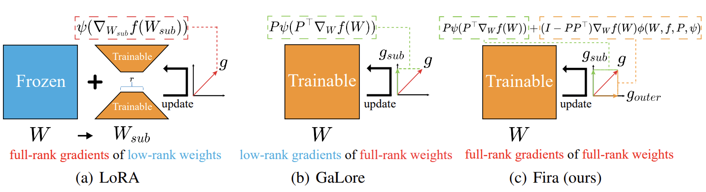
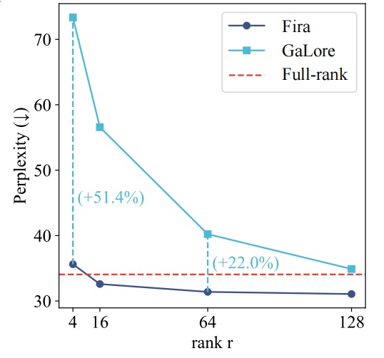

# Fira: Can We Achieve Full-rank Training of LLMs Under Low-rank Constraint?

[](https://arxiv.org/abs/2410.01623)




## Introduction

We introduce Fira, a plug-and-play memory-efficient training framework of LLMs. 

Different from LoRA and Galore, we realize training with full-rank gradients of full-rank weights, constituting the first attempt to achieve full-rank training consistently under the low-rank constraint.

Our method is easy to implement, basically relying on just two lines of equations.


## TODOs

- [ ] Release the pra-training code (in 3 days)
- [ ] Release the fine-tuning code (in 3 days)
- [ ] Package our Fira into a Python library for easy use


## Usage

### Set up the environment
```bash
pip install -r requirements.txt
```
Our experiment scripts are validated on Python 3.9 with PyTorch 2.2.2.

## Pre-Training LLaMA on C4 dataset
The `torchrun_main.py` script is used for pre-training LLaMA models across different sizes (60M, 130M, 350m, 1B, 7B) on the C4 dataset. Benchmark scripts are located in the `scripts/pre_training_c4` directory. For instance, to pre-train a 60M model on C4 dataset, execute the following command:

```bash
# LLaMA-60M, Fira-Adam, 1 A100, 1 Node
torchrun --standalone --nproc_per_node 1 torchrun_main.py \
    --model_config llama_configs/llama_60m.json \
    --lr 0.01 \
    --alpha 0.25 \
    --rank 128 \
    --update_proj_gap 200 \
    --batch_size 256 \
    --total_batch_size 512 \
    --num_training_steps 10000 \
    --warmup_steps 1000 \
    --weight_decay 0 \
    --dtype bfloat16 \
    --eval_every 1000 \
    --optimizer fira_adamw 
```
Script training is directly connected to [huggingface](https://huggingface.co/). C4 datasets may not be directly connected using mirror sites. Tutorials for downloading and training using a local dataset will be uploaded soon!

<!-- ### Performance under varying ranks
Assess the performance of Fira under varying ranks by pre-training the LLaMA 60M model on the C4 dataset ($d_{model}=256$, i.e., the full-rank dimension of models).


Notably, even when the ranks are set very low (4 and 16), Fira still achieves performance comparable to full-rank training. In contrast, the performance of GaLore significantly declines in these cases. These results highlight the superiority of our proposed Fira at lower ranks and its effectiveness in reducing memory usage ($r \propto M$, where $M$ is the memory usage of optimizer states). -->

## Fine-Tuning LLaMA

## Acknowledgement
This implementation is based on code from several repositories.
* [Galore](https://github.com/jiaweizzhao/GaLore)


## Citation

```
@article{chen2024firaachievefullranktraining,
      title={Fira: Can We Achieve Full-rank Training of LLMs Under Low-rank Constraint?}, 
      author={Xi Chen and Kaituo Feng and Changsheng Li and Xunhao Lai and Xiangyu Yue and Ye Yuan and Guoren Wang},
      journal={arXiv},
      year={2024},
}
```

